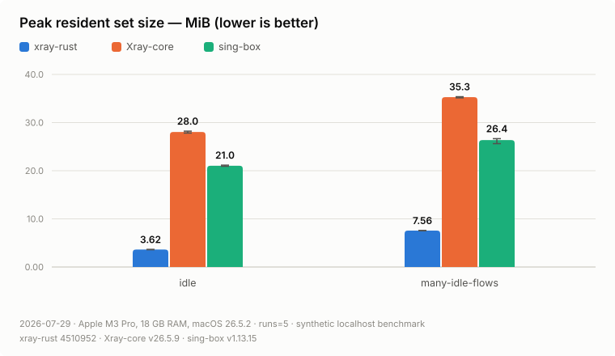
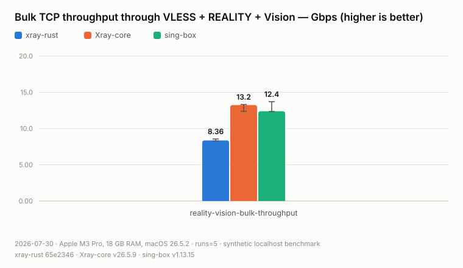
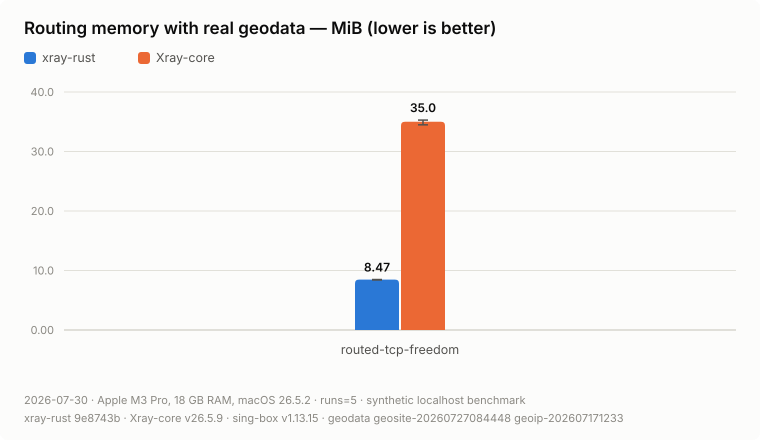

# xray-rust

`xray-rust` is an experimental, mobile/client-first Rust implementation of a
focused subset of the Xray configuration and proxy protocols. It provides a
native runtime, a C ABI, and reference adapters for Apple platforms and
Android. The long-term direction is one embeddable client/server library;
server-side Xray protocols are not implemented yet.

This project is unofficial and is not affiliated with XTLS or Xray-core. It is
not a drop-in replacement for Xray-core, has not been independently security
audited, and should not yet be treated as a production-ready VPN SDK.

## Benchmarks

Synthetic localhost comparison against Xray-core `v26.5.9` and sing-box
`v1.13.15` with the process-level [benchmark harness](docs/benchmarks.md)
(medians across 5 runs; measured 2026-07-31 on Apple M3 Pro, macOS 26.5.2,
xray-rust `3f70759`).

Lowest resident memory at every scale — 3.56 MiB idle and 17.9 MiB with
1000 held SOCKS flows, against 80.1 MiB for Xray-core and 46.8 MiB for
sing-box:

<picture>
  <source media="(prefers-color-scheme: dark)" srcset="docs/benchmarks/media/memory-rss-dark.svg">
  
</picture>

Fastest through a full VLESS + REALITY + Vision tunnel — 13.0 Gbps at the
lowest CPU cost per GiB (840 ms vs 890/880):

<picture>
  <source media="(prefers-color-scheme: dark)" srcset="docs/benchmarks/media/reality-throughput-dark.svg">
  
</picture>

About 4× less memory than Xray-core with real V2Fly geodata loaded:

<picture>
  <source media="(prefers-color-scheme: dark)" srcset="docs/benchmarks/media/geo-memory-dark.svg">
  
</picture>

Latency, plain-SOCKS bulk throughput, and CPU-per-GiB charts, plus the full
narrative and measurement caveats, are in
[benchmark results](docs/benchmarks/results.md).

## Current scope

| Area | Implemented | Important limits |
| --- | --- | --- |
| Local inbounds | SOCKS5 no-auth `CONNECT` and `UDP ASSOCIATE`, HTTP `CONNECT`, TUN | No authenticated proxy inbound or server-side Xray protocols |
| Outbounds | Freedom/direct and VLESS client over TCP | No VMess, Trojan, Shadowsocks, WireGuard, balancers, or outbound chaining |
| Security and flow | TLS, REALITY, `xtls-rprx-vision`, VLESS UDP and XUDP paths | Only the documented config subset and supported REALITY fingerprints |
| Routing and DNS | Field rules, domain/IP matchers, `geosite`/`geoip`, routed multi-address A/AAAA/CNAME resolution with `queryStrategy` and TTL-aware cache, ordered `dns.hosts` IP arrays, UDP/TCP DNS proxy, bounded fake-IP, and opt-in Xray-compatible TCP Happy Eyeballs | No `UseSystem` route probing, DoH/DoT, negative/stale cache, or full Xray DNS/routing parity |
| Mobile | Swift Package/Xcode sample for iOS, tvOS, and macOS; Android library and `VpnService` adapter | Signing, entitlements, VPN consent, foreground policy, and release packaging remain host-app responsibilities |

See [project status](docs/status.md) and
[configuration compatibility](docs/config-compatibility.md) for the detailed
matrix.

## Prerequisites

- Rust via `rustup`; [`rust-toolchain.toml`](rust-toolchain.toml) selects the
  exact toolchain used by the workspace.
- A C toolchain for native dependencies.
- Go only for deterministic oracle tools and optional Xray-core interoperability
  tests.
- Xcode for Apple artifacts, or JDK 17+, Android SDK 35, CMake 3.22.1, and NDK
  26.3.11579264 for Android artifacts.

## Quick start

Run the same Rust checks used by CI:

```sh
cargo fmt --all -- --check
cargo clippy --workspace --all-targets --all-features --locked -- \
  -D warnings -W clippy::perf -W clippy::suspicious
cargo test --workspace --all-targets --locked
```

For a local CLI smoke run, use the credential-free loopback example:

```sh
cargo run --locked -p xray-cli -- run \
  -config examples/freedom.json
```

The command starts a SOCKS5 listener at `127.0.0.1:1080`, routes directly
through the host network, and waits for `Ctrl-C`. It contains no proxy
credential. For VLESS, copy a synthetic fixture from
`tests/fixtures/configs/` outside the repository and replace every placeholder.
Never commit a live UUID, key, short ID, endpoint, or subscription URL.

For a self-contained data-path test that needs no external server:

```sh
cargo test --locked -p xray-core-rs \
  --test runtime_data_path_tests \
  socks_client_reaches_echo_target_through_freedom_outbound
```

## Mobile samples

Apple:

```sh
scripts/check-mobile-toolchains.sh --apple
scripts/build-apple-xcframework.sh
scripts/fetch-geodata.sh
open platform/apple/XrayClient/XrayClient.xcodeproj
```

The Xcode project consumes
`target/mobile/apple/XrayRust.xcframework` through the local Swift Package.
Choose the `XrayClient`, `XrayClientTv`, or `XrayClientMac` scheme. The
committed project builds unsigned under placeholder `org.example` identifiers;
to sign it, copy
`platform/apple/XrayClient/Config/Local.xcconfig.example` to `Local.xcconfig`
in the same directory and set your bundle prefix and Team ID there. That file
is git-ignored, so your identity stays out of the repository and Xcode leaves
nothing to commit. Register App IDs matching your prefix first — the tunnel
targets request the `packet-tunnel-provider` entitlement. The geodata download is needed by the checked-in Xcode
resource build phases; profiles that do not use geodata can omit those files in
a custom host project. See [Apple integration](platform/apple/README.md).

Android:

```sh
scripts/check-mobile-toolchains.sh --android
scripts/build-android-adapter.sh
```

This produces
`platform/android/xraymobile/build/outputs/aar/xraymobile-debug.aar`. See
[Android integration](platform/android/README.md).

## Distribution model

The repository is currently source-only. It does not publish crates, a Maven
artifact, or a downloadable Swift binary target. In particular,
`platform/apple/Package.swift` references a locally built XCFramework, so adding
this repository as a remote Swift Package is not sufficient by itself. Build
the native artifact first.

## Documentation

- [Status and supported features](docs/status.md)
- [Architecture](docs/architecture.md)
- [Configuration compatibility](docs/config-compatibility.md)
- [C ABI lifecycle and ownership](docs/ffi.md)
- [Verification](docs/verification.md)
- [Mobile testing](docs/mobile-testing.md)
- [Benchmark methodology](docs/benchmarks.md)
- [Benchmark results](docs/benchmarks/results.md)
- [Contributing](CONTRIBUTING.md)
- [Security policy](SECURITY.md)
- [Third-party notices](THIRD_PARTY_NOTICES.md)

## License

The project source is licensed under the
[Mozilla Public License 2.0](LICENSE). Downloaded geodata and other third-party
components remain under their respective licenses; see
[THIRD_PARTY_NOTICES.md](THIRD_PARTY_NOTICES.md).
