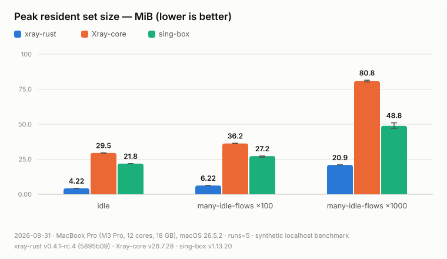
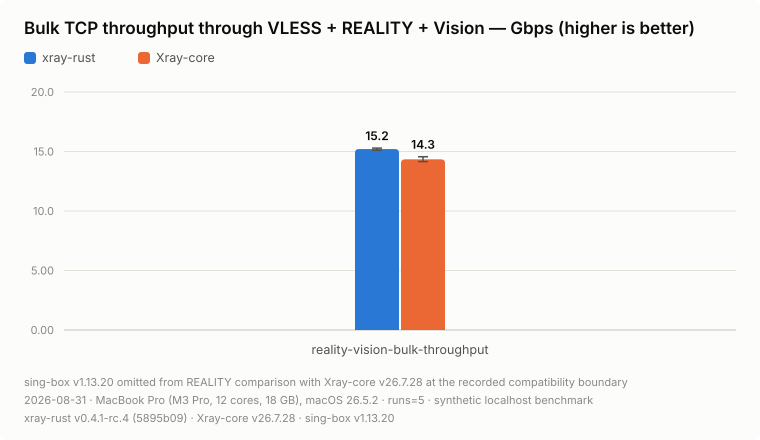
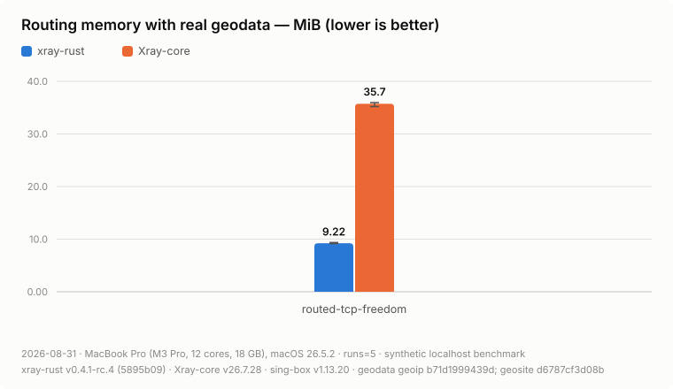

# xray-rust

Project website: [xray-rust.aimalygin.chatgpt.site](https://xray-rust.aimalygin.chatgpt.site)

`xray-rust` is a mobile/client-first Rust implementation of Xray configuration
and proxy protocols. It provides a native runtime, a C ABI, and integrations
for Apple platforms and Android. The current release focuses on an embeddable
client runtime; its supported compatibility surface is documented below.

This project is unofficial and is not affiliated with XTLS or Xray-core.

Current stable release: [`v0.5.0`](https://github.com/aimalygin/xray-rust/releases/tag/v0.5.0).

## Benchmarks

The latest published synthetic localhost evidence compares the `v0.4.1-rc.4`
benchmark candidate `5895b09`
with Xray-core `v26.7.28`
(`5ca6f4b7d4dc20a881d4330e498892697627ec0c`) and stable sing-box `v1.13.20`
(`56f91dfeabd6f4edbd437dfcc1e5b0ebc856b778`). Values are medians across five
release runs from the 2026-08-31 result group on an Apple M3 Pro MacBook Pro
with 18 GB RAM and macOS 26.5.2. The [full dated evidence](docs/benchmarks/results/2026-08-31-v26.7.28/README.md)
contains 139 validated series, exact binary hashes, tables, omissions, and raw
archive provenance.

Lowest resident memory at every measured idle-flow scale — 4.2 MiB idle and
20.9 MiB with 1,000 held SOCKS flows, against 80.8 MiB for Xray-core and
48.8 MiB for sing-box:

<picture>
  <source media="(prefers-color-scheme: dark)" srcset="docs/benchmarks/results/2026-08-31-v26.7.28/media/memory-rss-dark.svg">
  
</picture>

Through a full VLESS + REALITY + Vision tunnel, xray-rust reaches 15.2 Gbps
against Xray-core's 14.3 at 760 versus 800 CPU ms/GiB. Stable sing-box is
omitted here because its REALITY client version is below the pinned server's
default minimum:

<picture>
  <source media="(prefers-color-scheme: dark)" srcset="docs/benchmarks/results/2026-08-31-v26.7.28/media/reality-throughput-dark.svg">
  
</picture>

About 3.9× less memory than Xray-core with the pinned V2Fly geodata loaded:

<picture>
  <source media="(prefers-color-scheme: dark)" srcset="docs/benchmarks/results/2026-08-31-v26.7.28/media/geo-memory-dark.svg">
  
</picture>

Latency, bulk, all 36 stream cases, XHTTP pressure and bounded-memory tables,
plus the full caveats are in the [dated result group](docs/benchmarks/results/2026-08-31-v26.7.28/README.md).
The earlier Xray-core v26.5.9 and xray-rust DNS charts remain available as
[historical evidence](docs/benchmarks/results.md).

## Current scope

| Area | Implemented | Important limits |
| --- | --- | --- |
| Local inbounds | SOCKS5 no-auth `CONNECT` and `UDP ASSOCIATE`, HTTP `CONNECT`, TUN | No authenticated proxy inbound or server-side Xray protocols |
| Outbounds | Freedom/direct, VLESS client over TCP, DNS, health-aware selector groups including bounded `leastLoad`, and validated transport-layer TCP chaining | No VMess, Trojan, Shadowsocks, WireGuard, or chaining outside the documented TCP subset |
| Security and flow | TLS and REALITY with uTLS-shaped ClientHellos, `xtls-rprx-vision`, VLESS UDP and XUDP paths | Only the documented config subset; REALITY rejects the 14 fingerprints that carry no X25519 key share, while plain TLS accepts all 61 |
| Routing and DNS | Field rules with domain/IP/network/port matchers, `geosite`/`geoip`, atomic rule/geodata snapshot replacement, Xray `routing.balancers` plus bounded `observatory` URL health checks and `leastLoad`, cycle-free TCP outbound graph edges, Xray-style DNS server selection including routed `tls://` DoT, routed/local HTTP/2 DoH, and provider-local `quic+local://` DoQ, routed multi-address resolution, TTL-aware positive/negative cache with bounded stale-while-revalidate, `dns.hosts`, bounded fake IP, and DNS-outbound Direct/Drop/Return/Hijack policy | Full config and outbound/balancer topology replacement still requires a new core; no UDP/protocol-layer outbound chaining, `UseSystem` route probing, per-server cache policy, or full Xray DNS/routing parity |
| Mobile | Swift Package/Xcode sample for iOS, tvOS, and macOS; Android library and `VpnService` adapter | Signing, entitlements, VPN consent, foreground policy, and release packaging remain host-app responsibilities |
| Management | ABI 1.4 plus Swift/Kotlin expose routing-policy replacement/snapshots, typed SOCKS TCP/UDP, HTTP TCP, and TUN TCP/UDP connection inventory, addressable close, cumulative per-outbound accounting, and equivalent typed TUN diagnostic queues | Policy updates affect new flows only; inventory is live and accounting is process-lifetime cumulative; no persistent connection history |

See [project status](docs/status.md) and
[configuration compatibility](docs/config-compatibility.md) for the detailed
matrix.

## Prerequisites

- Rust via `rustup`; [`rust-toolchain.toml`](rust-toolchain.toml) selects the
  exact toolchain used by the workspace.
- A C toolchain for native dependencies.
- Go only for deterministic oracle tools and optional Xray-core interoperability
  tests.
- Xcode for Apple artifacts, or JDK 17+, Android SDK 35, CMake 3.22.1, and NDK
  26.3.11579264 for Android artifacts.

## Quick start

Run the same Rust checks used by CI:

```sh
cargo fmt --all -- --check
cargo clippy --workspace --all-targets --all-features --locked -- \
  -D warnings -W clippy::perf -W clippy::suspicious
cargo test --workspace --exclude xray-rust-fuzz --all-targets --locked
```

For a local CLI smoke run, use the credential-free loopback example:

```sh
cargo run --locked -p xray-cli -- run \
  -config examples/freedom.json
```

The command starts a SOCKS5 listener at `127.0.0.1:1080`, routes directly
through the host network, and waits for `Ctrl-C`. It contains no proxy
credential. For VLESS, copy a synthetic fixture from
`tests/fixtures/configs/` outside the repository and replace every placeholder.
Never commit a live UUID, key, short ID, endpoint, or subscription URL.

For a self-contained data-path test that needs no external server:

```sh
cargo test --locked -p xray-core-rs \
  --test runtime_data_path_tests \
  socks_client_reaches_echo_target_through_freedom_outbound
```

## Mobile samples

Apple:

```sh
scripts/check-mobile-toolchains.sh --apple
scripts/build-apple-xcframework.sh
scripts/fetch-geodata.sh
open platform/apple/XrayClient/XrayClient.xcodeproj
```

The Xcode project consumes
`target/mobile/apple/XrayRust.xcframework` through the local Swift Package.
Choose the `XrayClient`, `XrayClientTv`, or `XrayClientMac` scheme. The
committed project builds unsigned under placeholder `org.example` identifiers;
to sign it, copy
`platform/apple/XrayClient/Config/Local.xcconfig.example` to `Local.xcconfig`
in the same directory and set your bundle prefix and Team ID there. That file
is git-ignored, so your identity stays out of the repository and Xcode leaves
nothing to commit. Register App IDs matching your prefix first — the tunnel
targets request the `packet-tunnel-provider` entitlement. The geodata download is needed by the checked-in Xcode
resource build phases; profiles that do not use geodata can omit those files in
a custom host project. See [Apple integration](platform/apple/README.md).

Android:

```sh
scripts/check-mobile-toolchains.sh --android
scripts/build-android-adapter.sh
```

This produces
`platform/android/xraymobile/build/outputs/aar/xraymobile-debug.aar`. See
[Android integration](platform/android/README.md).

## Prebuilt mobile SDK

Ready-to-integrate Apple and Android packages are published from
[`xray-rust-mobile`](https://github.com/aimalygin/xray-rust-mobile). Each mobile
release pins a reviewed core commit and includes checksums and a release
manifest that identify the corresponding source.

Add the Apple SDK with Swift Package Manager:

```swift
dependencies: [
    .package(
        url: "https://github.com/aimalygin/xray-rust-mobile.git",
        exact: "0.5.0"
    ),
]
```

The package provides the low-level `XrayMobileAdapter`, shared profile and
storage APIs in `XrayAppleShared`, and the ready-to-subclass
`XrayAppleTunnel` packet-tunnel provider. Android applications can consume
`io.github.aimalygin:xray-rust-mobile:0.5.0` from Maven Central without GitHub
credentials, or download the standalone AAR from the matching release. See the
[`xray-rust-mobile` integration guide](https://github.com/aimalygin/xray-rust-mobile#readme)
for setup details.

## Documentation

- [Development roadmap](docs/roadmap.md)
- [Status and supported features](docs/status.md)
- [Architecture](docs/architecture.md)
- [Configuration compatibility](docs/config-compatibility.md)
- [C ABI lifecycle and ownership](docs/ffi.md)
- [Verification](docs/verification.md)
- [Mobile testing](docs/mobile-testing.md)
- [Benchmark methodology](docs/benchmarks.md)
- [Benchmark results](docs/benchmarks/results.md)
- [Contributing](CONTRIBUTING.md)
- [Security policy](SECURITY.md)
- [Third-party notices](THIRD_PARTY_NOTICES.md)

## License

The project source is licensed under the
[Mozilla Public License 2.0](LICENSE). Downloaded geodata and other third-party
components remain under their respective licenses; see
[THIRD_PARTY_NOTICES.md](THIRD_PARTY_NOTICES.md).
