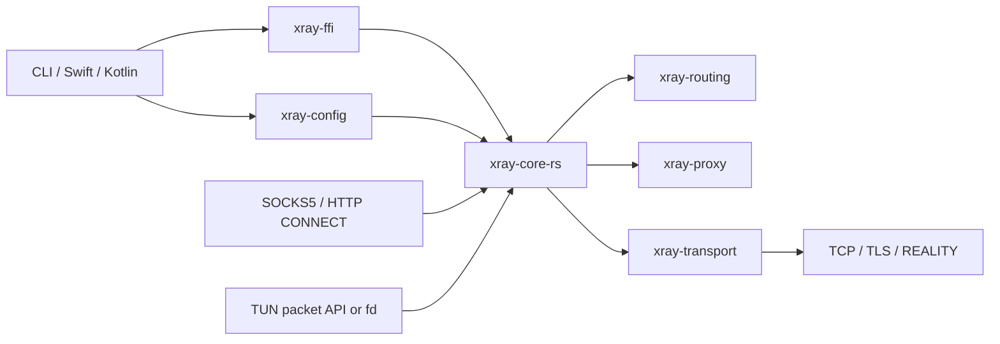

# Architecture

The workspace separates configuration, protocol encoding, transport, runtime,
platform ABI, and host adapters. The split keeps mobile code thin and lets most
behavior run in hermetic Rust integration tests.

## Workspace crates

| Crate | Responsibility |
| --- | --- |
| `xray-config` | Parses the supported Xray JSON subset, diagnostics, geodata lookup, and resource budgets |
| `xray-routing` | Platform-neutral target/session types and router contracts |
| `xray-proxy` | SOCKS/HTTP parsing plus VLESS, Vision, UDP, and XUDP wire framing |
| `xray-utls` | Supported REALITY fingerprint names and normalization |
| `xray-transport` | DNS, socket protection, TCP, TLS, REALITY handshake, and shaped ClientHello support |
| `xray-tun` | Bounded packet queues, counters, and diagnostic events |
| `xray-runtime` | Cooperative shutdown primitive |
| `xray-core-rs` | Lifecycle, listeners, routing, outbound selection, policy, TUN TCP/UDP/ICMP runtime |
| `xray-ffi` | Stable C ABI and embedded Tokio runtime |
| `xray-cli` | `xray-rust run -config …` executable |
| `xray-bench` | Local workload and comparison harness |

## Configuration path

1. JSON is parsed into `CoreConfig`.
2. Unsupported modeled fields become path-aware errors; security-sensitive
   compatibility choices such as `allowInsecure` become warnings.
3. `geosite` and `geoip` references are resolved during parsing from configured
   search directories.
4. `Core` builds the DNS resolver, outbound router, TUN queues, and listeners
   from the immutable config.

A core is not hot-reloaded. The FFI intentionally permits one successful config
load per handle; replacing a config requires a new handle.

## Data paths

### Local proxy

SOCKS5 and HTTP listeners parse a target, optionally sniff an initial payload,
select a routing rule, then open either a Freedom stream/socket or a VLESS
stream. The selected VLESS stream may use plain TCP, TLS, or REALITY and may add
Vision framing.

### TUN

The host either pushes and polls raw IP packets through the C ABI or registers a
platform TUN file descriptor. `xray-core-rs` drives the userspace TCP/UDP path,
applies sniffing and routing, and emits response packets through bounded
`xray-tun` queues. Android uses raw-IP fd framing; Darwin's optional direct path
uses the four-byte utun address-family header.

The packet-pump and fd-backed modes are alternatives for the same `TunEndpoint`.
Android defaults to fd-backed operation. The Apple provider uses a discovered
Darwin utun fd when enabled and available, otherwise it falls back to the
`NEPacketTunnelFlow` packet pump.

### DNS

DNS is split at the wire-transport boundary instead of being owned by TUN.
`xray-transport` builds and validates DNS messages, handles A/AAAA/CNAME
resolution, server failover, UDP truncation with same-server TCP retry, and the
bounded resolver cache. `xray-core-rs` supplies a routed query transport that
opens each DNS exchange through the normal outbound router. SOCKS, HTTP, TUN,
startup probes, and future server inbounds can therefore share the same DNS
semantics without depending on a packet adapter.

Each runtime keeps destination and bootstrap resolution as separate roles.
Destination resolution may use routed `dns.servers`; bootstrap resolution only
resolves the proxy or DNS upstream needed to open that route and must not call
back into destination DNS. TUN's raw DNS proxy and fake-IP engine are consumers
of these roles, not alternative resolvers.

The generic core and C ABI retain system bootstrap as their default for
desktop, command-line, and future server embeddings. Mobile full-tunnel
adapters resolve and pin required bootstrap names before installing the
interface, then select the fail-closed static policy so captured system DNS
cannot recurse into the tunnel. This platform preflight is deliberately outside
the Rust DNS service and does not change the original domain targets.

## Concurrency and lifecycle

Each FFI handle owns a Tokio runtime. Listener, DNS, outbound, and TUN work runs
as asynchronous tasks with cooperative shutdown. Flow budgets, bounded packet
queues, timeouts, and backpressure bound the TUN path and the SOCKS UDP relay;
inbound TCP concurrency has no application-level cap and is bounded by the
process file-descriptor limit, with accept errors retried under backoff.

Lifecycle/configuration operations are serialized by the host adapters.
Documented data-path calls may run concurrently, but never concurrently with
load/start/stop/set/free operations. See [the C ABI contract](ffi.md).

## Platform boundary

- Apple builds `xray-ffi` as static-library XCFramework slices and exposes
  Swift wrappers plus `NEPacketTunnelProvider` reference code.
- Android builds `libxray_ffi.so`, links a small C++ JNI bridge, and exposes a
  Kotlin wrapper plus `VpnService`.
- Outbound socket protection is injected before config load so Android can call
  `VpnService.protect(fd)` before proxy sockets enter the VPN route.

The repository distributes source, not a hosted binary SDK. Native artifacts
are generated locally and are deliberately outside the source package.
