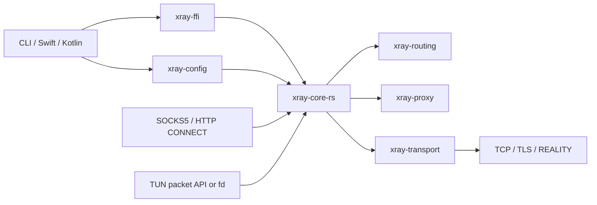

# Architecture

The workspace separates configuration, protocol encoding, transport, runtime,
platform ABI, and host adapters. The split keeps mobile code thin and lets most
behavior run in hermetic Rust integration tests.

## Workspace crates

| Crate | Responsibility |
| --- | --- |
| `xray-config` | Parses the supported Xray JSON subset, diagnostics, geodata lookup, and resource budgets |
| `xray-routing` | Platform-neutral target/session types and router contracts |
| `xray-proxy` | SOCKS/HTTP parsing plus VLESS, Vision, UDP, and XUDP wire framing |
| `xray-utls` | uTLS fingerprint names and normalization, shared by plain TLS and REALITY |
| `xray-transport` | DNS, socket protection, TCP, TLS, REALITY handshake, and shaped ClientHello support |
| `xray-tun` | Bounded packet queues, counters, and diagnostic events |
| `xray-runtime` | Cooperative shutdown primitive |
| `xray-core-rs` | Lifecycle, listeners, routing, outbound selection, policy, TUN TCP/UDP/ICMP runtime |
| `xray-ffi` | Stable C ABI and embedded Tokio runtime |
| `xray-cli` | `xray-rust run -config …` executable |
| `xray-bench` | Local workload and comparison harness |

## Configuration path

1. JSON is parsed into `CoreConfig`.
2. Unsupported modeled fields become path-aware errors; security-sensitive
   compatibility choices such as `allowInsecure` become warnings.
3. `geosite` and `geoip` references are resolved during parsing from configured
   search directories.
4. `Core` builds the DNS resolver, outbound router, TUN queues, and listeners
   from the immutable config.

A core is not hot-reloaded. The FFI intentionally permits one successful config
load per handle; replacing a config requires a new handle.

## Data paths

### Local proxy

SOCKS5 and HTTP listeners parse a target, optionally sniff an initial payload,
select a routing rule, then open either a Freedom stream/socket or a VLESS
stream. The selected VLESS stream may use plain TCP, TLS, or REALITY and may add
Vision framing.

### TCP candidate dialing

Resolved Freedom and VLESS TCP targets retain their ordered socket-address
candidates. An explicitly enabled `streamSettings.sockopt.happyEyeballs` policy
reorders those candidates by stable address-family chunks and races raw TCP
connects with a bounded stagger. IPv4 is preferred by default;
`prioritizeIPv6` reverses that preference, `interleave` controls the family
chunk size, and `interleave: 0` exhausts the preferred family before the
alternate family. A fast TCP failure starts the next candidate immediately.

TLS and REALITY are deliberately outside the race: configuration and SNI are
validated first, raw TCP candidates race, and exactly one cryptographic
handshake runs on the winning stream. The scheduler owns its connect futures
directly rather than spawning detached tasks. Success, fatal socket-protection
failure, caller cancellation, or dropping the dial future therefore cancels
all losing attempts in place.

### TUN

The host either pushes and polls raw IP packets through the C ABI or registers a
platform TUN file descriptor. `xray-core-rs` drives the userspace TCP/UDP path,
applies sniffing and routing, and emits response packets through bounded
`xray-tun` queues. Android uses raw-IP fd framing; Darwin's optional direct path
uses the four-byte utun address-family header.

The packet-pump and fd-backed modes are alternatives for the same `TunEndpoint`.
Android defaults to fd-backed operation. The Apple provider uses a discovered
Darwin utun fd when enabled and available, otherwise it falls back to the
`NEPacketTunnelFlow` packet pump.

### DNS

DNS is split at the wire-transport boundary instead of being owned by TUN.
`xray-transport` builds and validates DNS messages, retains ordered A/AAAA
candidates with authoritative or remaining TTL metadata, handles CNAME
resolution, server failover, UDP truncation with same-server TCP retry, and the
bounded resolver cache. Object name-server policies select matching domains
before ordered fallback, with Xray-compatible skip/disable/final behavior; a
CNAME-only continuation stays on the answering name server. Policies compile
once into the same mobile-oriented shape used by Xray's Compact matcher: exact
names use a hash set, suffixes a reverse-label trie, and the less common
keyword/regex rules retain linear matching. The compiled set is shared by all
routed resolver contexts instead of cloning geosite expansions.
Per-server expected/unexpected IP rules share that lifecycle and compile into
merged IPv4/IPv6 ranges, keeping GeoIP-sized filters off the per-answer linear
path. Hard rejections advance the sticky server plan with the original qname;
soft rules only prefer a nonempty subset. Global and per-server family
policies are intersected at this resolver boundary: `UseIP`
queries both families, while `UseIPv4` or `UseIPv6` sends
only the selected wire query and filters static/fallback candidates. Static
`dns.hosts` entries can supply one IP, an alias domain, or an ordered nonempty
IP array; every permitted-family IP remains a dial candidate.
Unprefixed host keys follow Xray's exact/full semantics, while explicit matcher
prefixes retain their normal meaning.
Each managed policy carries an Xray-compatible per-client deadline, defaulting
to four seconds. A/AAAA, same-server UDP-to-TCP retry, and the Rust CNAME
continuation share that absolute deadline; serial failover restarts from the
original name with a fresh budget for the next policy. Configured resolution
has no hidden aggregate cap, while the no-server system fallback remains
bounded and an embedding can explicitly impose a stricter whole-operation
deadline. Bootstrap of a domain-valued server deliberately has no independent
five-second cap: it consumes the enclosing candidate deadline. Timeout futures
own routed socket exchanges directly, so cancellation drops their in-flight I/O
rather than leaving detached network tasks behind.
The operating-system `getaddrinfo` used by optional `System` bootstrap is the
exception: Tokio's blocking lookup may finish after its caller times out.
Mobile full-tunnel adapters avoid that path after start by pinning bootstrap
addresses and selecting `StaticOnly`; a future native async bootstrap backend
should remove this platform limitation for long-running server embeddings.
`xray-core-rs` supplies a transport-aware query service. Classic DNS and
`tcp://` exchanges open through the normal outbound router; `tcp+local://`
resolves only through the bootstrap role and opens a protected direct TCP
socket without invoking routing. Every compiled name-server policy carries
its effective `dns.tag` as query metadata. The router sees that synthetic DNS
inbound tag—generated once as `xray.system.<uuid>` when no tag is configured—
instead of the application inbound that requested resolution. Per-server tags
can therefore select different routes during ordered failover without coupling
the shared resolver to SOCKS, HTTP, TUN, or future server listeners.
Application `IPIfNonMatch` tests rules in configuration order against every
resolved candidate. Internal DNS-upstream sessions deliberately set Xray's
`SkipDNSResolve` equivalent: tag/domain rules still apply, but routing cannot
recursively resolve the upstream required to answer the lookup. SOCKS, HTTP, TUN, startup probes, and
future server inbounds can therefore share the same DNS semantics without
depending on a packet adapter.

`Core::start` creates one destination/bootstrap resolver pair for the whole
core instance and passes cloned `Arc`s to every listener, TUN, and startup
probe. For managed construction, the destination LRU and its in-flight lookup
table are therefore shared across concurrent ingress consumers instead of
being multiplied per listener; separate `Core` instances remain isolated.
This per-instance ownership is the same shape needed by a long-running
multi-listener server without introducing process-global DNS state into mobile
embeddings.

Each runtime keeps destination and bootstrap resolution as separate roles.
Destination resolution answers where application traffic should go and may use
routed `dns.servers`; global `dns.queryStrategy` applies at this boundary.
Bootstrap resolution answers how to reach the outer proxy or DNS-upstream
endpoint needed to open that route, keeps all pinned/system address families,
and must not call back into destination DNS. This non-recursive split belongs to
the universal core, not to the mobile adapter: TUN's raw DNS proxy and fake-IP
engine are consumers of the roles, while future server inbounds can reuse
destination resolution without inheriting mobile bootstrap policy.
The TUN anchor is a fixed hybrid of managed DNS `Hijack` and wire-preserving
`Direct`. A strict, ordinary single-question IN A or AAAA request that does not
set AD/CD or request DNSSEC data with EDNS DO uses the shared destination
resolver, so `dns.hosts`, domain policy, family strategy, IP filters,
per-server deadlines, ordered fallback, routed tags, and the TTL-aware cache
all apply. The requested family is selected before DNS I/O and has its own
cache/single-flight key; an A request therefore cannot cause an AAAA wire query
or inherit the other family's TTL. The adapter synthesizes the matching
A/AAAA, NODATA, NXDOMAIN, or bounded SERVFAIL response. Managed synthesis
preserves a minimal empty EDNS(0) OPT when requested; UDP additionally returns
`TC=1` when the answer exceeds the client or tunnel-path limit.

Other ordinary question types, DNSSEC-sensitive A/AAAA requests, non-empty EDNS
options, and unsupported EDNS versions retain the raw `Direct` contract and
their original wire message. The managed resolver currently returns addresses
rather than complete RRsets or EDNS option state, so it must not pretend to
preserve RRSIG, ECS, COOKIE, or client-side validation semantics.
Raw selection is declaration-ordered and deliberately does not apply managed
`domains`, family strategy, IP filters, or per-policy fallback. Deployments
that rely on split-DNS privacy must therefore ensure every raw candidate the
plan may reach is appropriate whenever routing leaves the TUN anchor on this
fixed hybrid instead of selecting an explicit DNS outbound.
Classic candidates preserve raw messages, while a UDP client aimed at a TCP URI
is adapted to RFC 7766 framing through a bounded persistent-connection pool. A
TCP client uses one bounded multiplexed raw upstream session alongside its owned
managed A/AAAA lookups. Local answers may complete out of order and are
delivered independently of a concurrent raw dial or write. Raw responses are
correlated by transaction ID, opcode, and question, and only unanswered queries
are replayed after a post-open failure. EOF, I/O failure, timeout, malformed or
unmatched responses, `TC=1`, and SERVFAIL
advance through `dns.servers` via the same routed/protected dial path; other
matching RCODEs, including NXDOMAIN and NOERROR/NODATA, are terminal.
Exhaustion returns one framed SERVFAIL per unresolved raw query without closing
the client TCP session, so its next query can start a fresh cycle. The first
AXFR, IXFR, non-QUERY opcode, multi-question, or otherwise unsupported DNS
message hands the entire connection to the byte-transparent bridge, including
its exact prebuffer. This preserves zone transfer and extension semantics
instead of partially interpreting them.

The query-aware TCP adapter accepts at most 16 combined managed and raw pending
questions and 128 KiB of decoded input per client flow. Each DNS/TCP message may
use the complete 65,535-byte length-prefix range, while the combined byte limit
still bounds coalesced or pipelined frames. Upload reservations remain charged
to the TUN runtime until their frames are first flushed upstream or answered
locally; candidate and total budgets are tracked per raw query.
Managed lookup tasks are owned by the client flow, bounded by the same limits,
and aborted with it; no detached task owns a DNS query. Client and upstream
framing use cancellation-safe incremental decoders. The UDP-to-TCP adapter
keeps one request in flight per pooled upstream stream, retries a stale reused
stream once on a fresh protected/routed connection, and discards a leased
stream whenever the request is cancelled so partial framing is never reused.
Per-upstream and runtime-wide socket caps are selected by the TUN runtime
profile. UDP replies honor the client's valid EDNS(0) size and the
address-family tunnel path MTU; missing or malformed EDNS falls back to the
legacy 512-byte DNS payload limit, and oversized replies return `TC=1`.
Routed candidates carry the effective synthetic inbound tag into outbound
selection; local TCP candidates bypass it. Endpoint deduplication includes
transport and tag.

The general DNS outbound is a separate, compiled core handler rather than a
mutation of that fixed hybrid contract. Configuration accepts Xray's ordered
`Direct`/`Drop`/`Reject`/`Hijack` rules, compact QTYPE ranges, domain/geosite
matchers, component-wise rewrite target, deprecated legacy policy, and
`userLevel`. Routing now includes `network` and `port`, so TCP and UDP port 53
can select the handler without hard-coding the TUN anchor. First match wins;
the miss policy is Hijack for A/AAAA and Reject for every other QTYPE.

The policy parser reads only the first question before Direct, Drop, or Reject.
Direct therefore forwards the original message byte-for-byte, including
unknown DNSSEC, EDNS, and future extension data. Full envelope validation is
deferred until Hijack. A synthesis-unsafe A/AAAA query (AD/CD, EDNS DO,
non-empty options, unsupported EDNS, multiple questions, or non-IN class) is a
typed `HijackUnsafe` decision and the core DNS-outbound executor returns
REFUSED; it never silently converts that query to Direct and leaks it across
split-DNS policy. This is intentionally stricter than Xray-core's lossy Hijack
synthesis.

Direct applies network, address, and port rewrites independently. Omitted
components retain the captured target, and client/upstream framing remain
independent, so the core DNS-outbound executor supports UDP-to-TCP and
TCP-to-UDP queries. The protected direct path bypasses outbound routing,
resolves domain rewrites only through the bootstrap role, caps candidates at
eight, correlates replies,
and has a five-second total budget. Tunnel-local DNS endpoints are forbidden;
therefore Direct from the fixed `198.18.0.1:53` anchor needs a real rewrite
target and otherwise fails closed instead of looping.

Managed DNS clients carry their effective generated/global/per-server tag. If
such a trusted internal query routes back to the same DNS outbound, the handler
forces Direct before parsing or rule matching and applies the rewrite. This is
the Xray own-link recursion escape, with the additional requirement that the
runtime call site is a managed DNS transport; an application merely spoofing
the tag cannot obtain the bypass. Every routed or local `dns.servers` exchange
also acquires a Core-wide, non-waiting operation permit before resolution or
dialing. The permit covers Freedom, VLESS, selected DNS outbounds, UDP, TCP,
and TLS uniformly, so unique cache-miss names cannot escape the runtime profile
by choosing a different managed transport.

`Core::start` constructs one ingress-neutral DNS-outbound executor and one
optional FakeIP mapper, then shares them with TUN, SOCKS TCP/UDP, and HTTP
CONNECT. UDP queries remain owned by their ingress flow/task. Explicit DNS/TCP
policy uses one cancellation-owned, bounded decoder per client flow and
processes pipelined frames sequentially: Drop consumes a frame without
replying, Reject returns REFUSED without closing the flow, and no policy
operation creates a detached task. UDP clients rewritten to TCP/TLS reuse a
bounded per-Core idle pool. Ordinary TCP clients check out that same pool for
each message and recycle immediately after the matching response, preserving
in-order/coalesced framing without letting client think-time pin control-plane
sockets. Pool concurrency, key-table size, and idle TTL cap derive from the
selected runtime resource profile, scaling from mobile/low-memory bounds to the
server-oriented Throughput profile. Direct DNS UDP and managed Freedom DNS UDP
additionally share one Core-wide socket semaphore at the same profile limit;
the permit is acquired only after bootstrap resolution and is held for the UDP
socket lifetime. Saturation fails closed without queueing. The managed
transport permit, UDP socket permit, ingress DNS policy permit, and TCP pool
permits are deliberately distinct: a Hijack may hold its ingress permit while
performing a bounded managed lookup, without recursively acquiring the same
semaphore or deadlocking. UDP-source AXFR/IXFR is refused before a dial because
a single datagram cannot carry a multi-message transfer; TCP transfers alone
receive a dedicated non-pooled response-only handoff. The handoff carries its
ingress operation permit together with the managed transfer session, including
on the TUN path, so cancellation releases both TCP-pool and ingress budgets.
The same handler boundary can be passed to future server-protocol inbounds
without importing TUN packet semantics or process-global state.

When `dns.fakeIp` is enabled, Hijack applies `dns.hosts` before consulting the
shared mapper, matching Xray's static-host precedence; a wrong-family static
answer is NODATA and never falls through to FakeIP. Otherwise the mapper runs
before the managed resolver. Mappings created through SOCKS or HTTP are
therefore visible to TUN reverse lookup and vice versa. The fixed TUN FakeIP
mode is now another consumer of the same core-owned mapper rather than a
separate allocation domain. Pool size, TTL, query strategy, reserved tunnel
addresses, and the ordered lease-deadline index remain bounded per `Core`
instance. Fake-IP addresses are never reassigned before their most recently
advertised TTL; capacity exhaustion fails closed until the earliest lease
expires.

The generic core and C ABI retain system bootstrap as their default for
desktop, command-line, and future server embeddings. Mobile full-tunnel
adapters resolve and pin all usable bootstrap addresses before installing the
interface, then select the fail-closed static policy so captured system DNS
cannot recurse into the tunnel. Android protects every launched candidate
socket. Apple installs excluded `/32` and `/128` routes only for pinned VLESS
carrier addresses before starting the core. Pinned `dns.servers` addresses are
not globally excluded and therefore retain normal outbound routing. A carrier
answer containing a tunnel-owned interface or DNS-anchor address fails closed,
and the route builder defensively refuses to exclude those addresses. This
platform preflight is deliberately outside the Rust DNS service and does not
change the original domain targets.

## Concurrency and lifecycle

Each FFI handle owns a Tokio runtime. Listener, DNS, outbound, and TUN work runs
as asynchronous tasks with cooperative shutdown. Flow budgets, bounded packet
queues, timeouts, and backpressure bound the TUN path and the SOCKS UDP relay;
inbound TCP concurrency has no application-level cap and is bounded by the
process file-descriptor limit, with accept errors retried under backoff.

Lifecycle/configuration operations are serialized by the host adapters.
Documented data-path calls may run concurrently, but never concurrently with
load/start/stop/set/free operations. See [the C ABI contract](ffi.md).

## Platform boundary

- Apple builds `xray-ffi` as static-library XCFramework slices and exposes
  Swift wrappers plus `NEPacketTunnelProvider` reference code.
- Android builds `libxray_ffi.so`, links a small C++ JNI bridge, and exposes a
  Kotlin wrapper plus `VpnService`.
- Outbound socket protection is injected before config load so Android can call
  `VpnService.protect(fd)` for every launched TCP/UDP candidate before that
  socket enters the VPN route.

The repository distributes source, not a hosted binary SDK. Native artifacts
are generated locally and are deliberately outside the source package.
