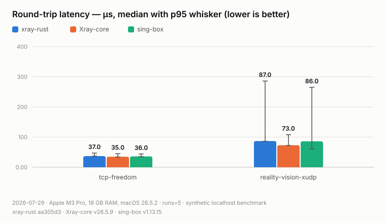
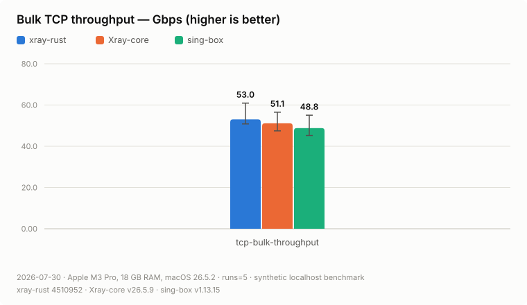
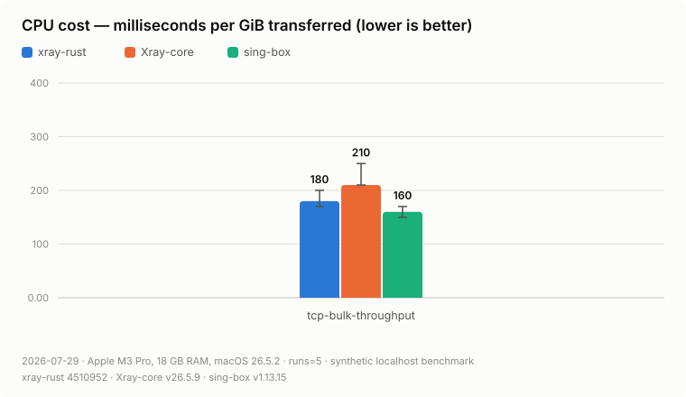
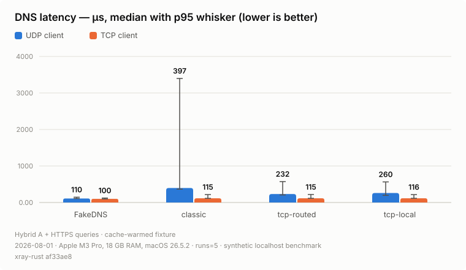
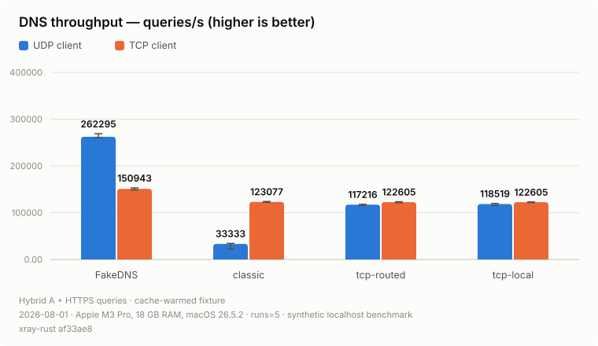
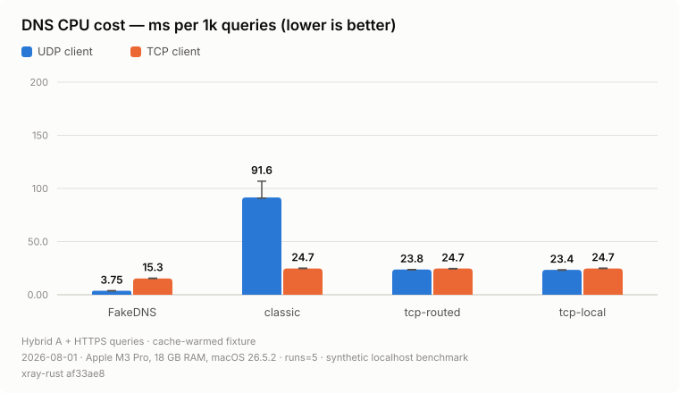
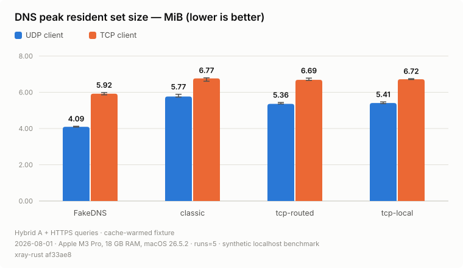

# Benchmark results

> **Historical publication (2026-08-01).** Every number and chart on this page
> belongs to xray-rust `af33ae8`, Xray-core `v26.5.9`, and sing-box `v1.13.15`.
> The current RC4 publication is the immutable
> [2026-08-29 Xray-core v26.7.28 result group](results/2026-08-29-v26.7.28/README.md).
> The historical files below are intentionally preserved rather than
> overwritten or relabelled.

Synthetic localhost comparison of `xray-rust`, Xray-core, and sing-box using
the process-level [benchmark harness](../benchmarks.md). Each engine runs as
a child process with an equivalent generated config while the harness samples
OS RSS/CPU counters and validates every payload byte. Bars are medians across
5 runs; whiskers span min to p95 (for latency, the whisker top is the median
run p95). Measured 2026-08-01 on Apple M3 Pro, 18 GB RAM, macOS 26.5.2 with
release builds: xray-rust `af33ae8`, Xray-core `v26.5.9`, sing-box
`v1.13.15`. The routing memory chart loads real, pinned V2Fly geodata
(`geosite 20260727084448`, `geoip 202607171233`); sing-box is absent
from that chart because it does not read Xray-format `.dat` rule data.

The headline memory, REALITY tunnel throughput, and geodata memory charts are
shown in the [README](../../README.md#benchmarks); this page carries the full
narrative and the remaining series.

In this run xray-rust holds the resident-memory edge at every scale: at idle
and 100 held flows by a wide margin, and at 1000 flows it stays lowest too —
18.3 MiB against Xray-core's 79.9 and sing-box's 46.1. The universal DNS
outbound had temporarily placed its roughly 2.9 KiB TCP state machine inside
every SOCKS connection future, raising the same-machine ×1000 median to
20.52 MiB. `af33ae8` heap-erases that state only after a DNS route is selected,
bringing the median back to 18.27 MiB, close to the 17.9 MiB pre-DNS baseline.
An earlier slope fix in `3f70759` also reduced the two relay copy buffers from
an eager 16 KiB to 4 KiB per flow (they still grow to 128 KiB under load).
With real geodata loaded xray-rust uses about 4× less memory than Xray-core.
Round-trip latency is comparable to both Go engines on the TCP echo path
(39.0 vs 35.0/37.0 µs), clearly the fastest on the plain SOCKS UDP relay
(37.0 vs 61.0/47.0 µs), and narrowly in front on the REALITY + Vision XUDP
path (83.0 vs 99.0/84.0 µs). On plain bulk throughput through SOCKS xray-rust
and sing-box remain close — 57.7 vs 56.4 Gbps with overlapping run ranges —
both ahead of Xray-core's 50.5; bulk medians on this workload move with machine
state between publications. CPU per GiB on that workload puts xray-rust
between the two (190 vs Xray-core's 235 and sing-box's 154 ms). Through a full
VLESS + REALITY + Vision tunnel xray-rust leads on both axes: 14.3 Gbps against
Xray-core's 13.7 and sing-box's 14.0, at the lowest CPU cost per GiB
(770 vs 820/790 ms).
Earlier publications had xray-rust clearly slowest here (8.36 Gbps at about
1270 ms per GiB); the gap was work per byte on the tunnel's read path —
socket reads forced to TLS record boundaries plus per-read buffer zeroing
and copying — removed in `05c33ac`. Throughput is measured over the transfer
window only (first byte to last validated byte) on an 8 GiB stream (1 GiB for
the tunnel chart): a gigabyte crosses loopback in roughly 150 milliseconds,
short enough that TCP window growth and CPU frequency scaling weighed on the
result, and per-engine setup cost was otherwise amortized into the rate.
Excluding setup helps Xray-core rather than us: the harness
fixture is identical for all three engines, but Xray-core answers SOCKS
eagerly and finishes its REALITY handshake lazily, spending about 640 ms
before its first byte against roughly 100–150 ms for the other two. On the
REALITY chart the Xray-core server fixture terminating the tunnel is not
sampled, but it shares loopback CPU with the measured client.
These are microbenchmarks of local proxy paths, not wide-area VPN performance;
cross-engine TUN workloads are not charted here. The DNS charts below are
xray-rust-only because they exercise its local DNS extensions.

<picture>
  <source media="(prefers-color-scheme: dark)" srcset="media/latency-dark.svg">
  
</picture>

<picture>
  <source media="(prefers-color-scheme: dark)" srcset="media/throughput-dark.svg">
  
</picture>

<picture>
  <source media="(prefers-color-scheme: dark)" srcset="media/cpu-per-gib-dark.svg">
  
</picture>

## DNS microbenchmarks

The DNS suite is an xray-rust internal-path comparison, not a comparison with
Xray-core or sing-box. Every point uses 5 release runs, 16 logical clients,
and 1000 iterations: 32,000 validated queries per raw run, split evenly
between A and HTTPS. All clients reuse one domain, so the managed A cache and
FakeDNS mapping are warm after the first query; HTTPS exercises the raw NODATA
path. These graphs therefore characterize steady local dispatch, framing,
pooling, and process cost, not cold recursive DNS, diverse-domain cache
behavior, or FakeDNS pool growth.

FakeDNS/UDP reaches 262k queries/s at 3.75 ms CPU per 1000 queries and 4.09 MiB
RSS. FakeDNS/TCP has a slightly lower median RTT (100 vs 110 µs), but framing
and TCP session state reduce it to 151k queries/s, 15.3 ms CPU per 1000, and
5.92 MiB RSS. For the proxy, explicit routed or local DNS-over-TCP upstreams
make UDP and TCP clients converge around 117k–123k queries/s and
23.4–24.7 ms CPU per 1000. TCP clients retain roughly 1.3 MiB more RSS for 16
active sessions, but their median RTT stays near 115 µs versus 232–260 µs for
the UDP-to-TCP adapter.

The clear optimization target is the classic UDP upstream path. Its UDP client
case manages 33.3k queries/s at 91.6 ms CPU per 1000, with a 397 µs median and
a 3.40 ms median p95. The raw HTTPS half opens and protects a fresh UDP
upstream socket per query; the TCP-client case reuses session state and reaches
123k queries/s at 24.7 ms CPU per 1000. The explicit TCP upstream modes pool
their transport too and avoid this outlier.

<picture>
  <source media="(prefers-color-scheme: dark)" srcset="media/dns-latency-dark.svg">
  
</picture>

<picture>
  <source media="(prefers-color-scheme: dark)" srcset="media/dns-query-rate-dark.svg">
  
</picture>

<picture>
  <source media="(prefers-color-scheme: dark)" srcset="media/dns-cpu-per-1k-queries-dark.svg">
  
</picture>

<picture>
  <source media="(prefers-color-scheme: dark)" srcset="media/dns-memory-rss-dark.svg">
  
</picture>

Reproduce with the release-build compare series and render charts with
`xray-bench chart`; the exact command chain and methodology are in
[Publishing Numbers and Charts](../benchmarks.md#publishing-numbers-and-charts).
