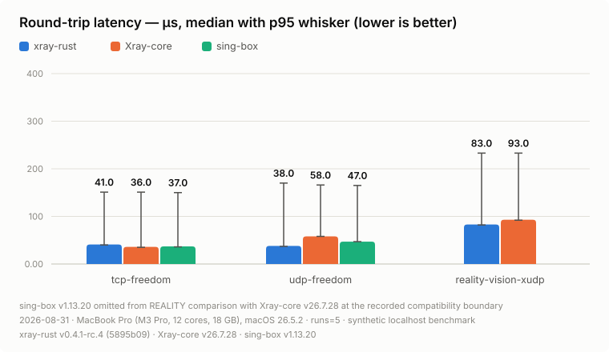
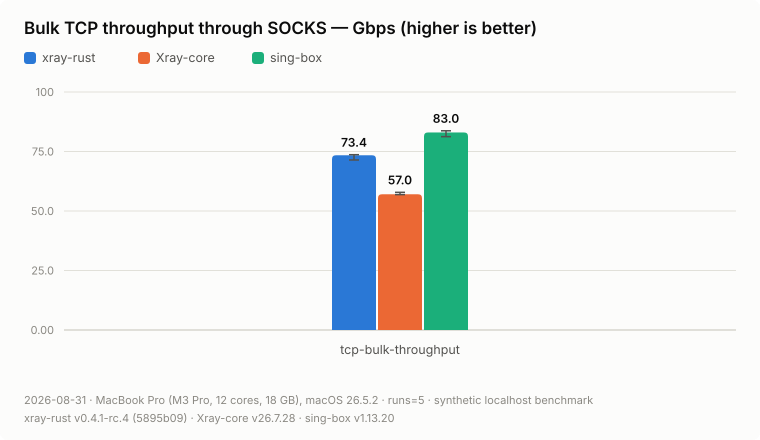
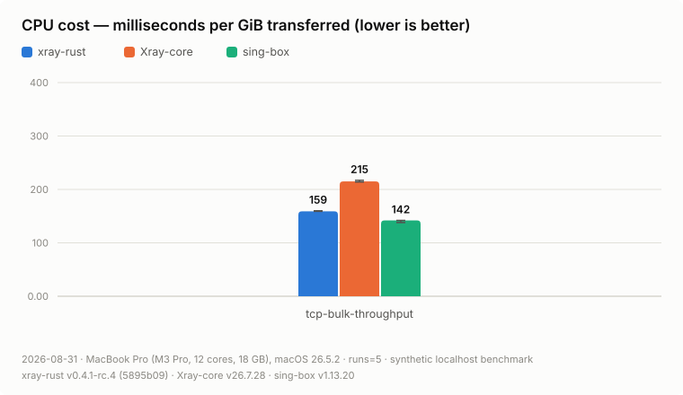
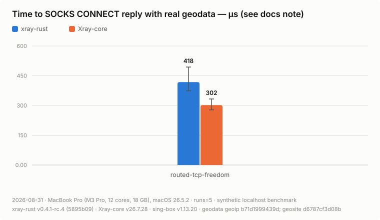

# RC4 benchmark evidence: Xray-core v26.7.28

This immutable result group contains the publication-quality localhost
benchmark campaign for xray-rust `v0.4.1-rc.4`, candidate
`5895b09239ea6d957a3fead814804e361ee6ef6d`. Every published series has five
successful release runs with embedded clean-source and binary-hash provenance.
The manifest contains 139 series and 695 per-run results.

The tagged source may add release-validation-only corrections after this
candidate: `.gitleaks.toml` may classify the two reviewed dated replay records
as false positives for the JFrog-token rule, and the publication policy test
may accept either safe failure reported by platform Python JSON decoders for
an over-nested input. Neither file builds the runtime or benchmark harness,
and neither changes this evidence.

The campaign identifier, measurement date, and publication date are
2026-08-31. It ran on a MacBook Pro (Mac15,7) with an Apple M3 Pro (12 cores),
18 GB RAM, and macOS 26.5.2. Comparators are Xray-core `v26.7.28` at
`5ca6f4b7d4dc20a881d4330e498892697627ec0c` and stable sing-box `v1.13.20` at
`56f91dfeabd6f4edbd437dfcc1e5b0ebc856b778`.

These are same-host process microbenchmarks. They validate payload bytes and
measure process RSS, CPU, setup, and transfer timing; they do not represent a
controlled WAN, packet-loss experiment, mobile energy test, or cross-engine
TUN comparison. Values below are five-run medians. RSS is peak resident memory.

## Headline charts

<picture>
  <source media="(prefers-color-scheme: dark)" srcset="media/memory-rss-dark.svg">
  
</picture>

<picture>
  <source media="(prefers-color-scheme: dark)" srcset="media/latency-dark.svg">
  
</picture>

<picture>
  <source media="(prefers-color-scheme: dark)" srcset="media/throughput-dark.svg">
  
</picture>

<picture>
  <source media="(prefers-color-scheme: dark)" srcset="media/reality-throughput-dark.svg">
  
</picture>

<picture>
  <source media="(prefers-color-scheme: dark)" srcset="media/cpu-per-gib-dark.svg">
  
</picture>

<picture>
  <source media="(prefers-color-scheme: dark)" srcset="media/geo-setup-latency-dark.svg">
  
</picture>

<picture>
  <source media="(prefers-color-scheme: dark)" srcset="media/geo-memory-dark.svg">
  
</picture>

## Base and reconnect results

| Scenario | Median metric | xray-rust | Xray-core | sing-box |
| --- | --- | ---: | ---: | ---: |
| idle | RSS, MiB | 4.2 | 29.5 | 21.8 |
| many-idle-flows-100 | RSS, MiB | 6.2 | 36.2 | 27.2 |
| many-idle-flows-1000 | RSS, MiB | 20.9 | 80.8 | 48.8 |
| tcp-freedom | RTT, µs | 41 | 36 | 37 |
| udp-freedom | RTT, µs | 38 | 58 | 47 |
| reconnect-burst | total setup, µs | 1,219 | 1,366 | 866 |
| reality-vision-xudp | RTT, µs | 83 | 93 | omitted |
| tcp-bulk-throughput | throughput, Gbps | 73.4 | 57.0 | 83.0 |
| reality-vision-bulk-throughput | throughput, Gbps | 15.2 | 14.3 | omitted |
| routed-tcp-freedom | total setup, µs | 1,209 | 1,090 | unsupported |
| routed-tcp-freedom | RSS, MiB | 9.2 | 35.7 | unsupported |

## Stream transport results

Each cell is `throughput Mbps / peak RSS MiB`. The workload transfers 4,096 ×
64 KiB per flow in the selected direction; full-duplex transfers that amount
in both directions.

| Scenario | xray-rust | Xray-core | sing-box |
| --- | ---: | ---: | ---: |
| stream-ws-upload-1 | 5,507 / 8.1 | 4,926 / 33.5 | 12,414 / 23.7 |
| stream-ws-upload-32 | 10,041 / 31.8 | 8,885 / 46.4 | 13,633 / 36.5 |
| stream-ws-download-1 | 9,587 / 7.2 | 7,509 / 34.3 | 8,013 / 26.4 |
| stream-ws-download-32 | 12,484 / 11.8 | 11,176 / 45.0 | 11,454 / 36.3 |
| stream-ws-full-duplex-1 | 9,043 / 8.3 | 3,765 / 34.8 | 12,272 / 26.8 |
| stream-ws-full-duplex-32 | 9,225 / 31.7 | 8,074 / 47.8 | 7,699 / 42.3 |
| stream-httpupgrade-upload-1 | 13,679 / 7.3 | 11,931 / 33.1 | 13,507 / 23.8 |
| stream-httpupgrade-upload-32 | 14,504 / 16.9 | 13,630 / 45.7 | 13,811 / 36.7 |
| stream-httpupgrade-download-1 | 14,222 / 7.0 | 12,486 / 32.9 | 14,036 / 25.7 |
| stream-httpupgrade-download-32 | 13,568 / 10.6 | 13,780 / 44.3 | 13,396 / 36.4 |
| stream-httpupgrade-full-duplex-1 | 16,712 / 7.4 | 14,659 / 33.9 | 16,331 / 25.7 |
| stream-httpupgrade-full-duplex-32 | 10,289 / 18.1 | 6,072 / 46.7 | 11,035 / 42.7 |
| stream-grpc-upload-1 | 17,180 / 9.3 | 12,272 / 36.5 | 10,130 / 24.8 |
| stream-grpc-upload-32 | 16,910 / 26.0 | 12,010 / 53.6 | 10,565 / 37.4 |
| stream-grpc-download-1 | 7,018 / 8.0 | 12,860 / 90.3 | 5,465 / 38.0 |
| stream-grpc-download-32 | 11,126 / 10.8 | 12,884 / 353.5 | 5,259 / 397.0 |
| stream-grpc-full-duplex-1 | 10,765 / 9.7 | 14,511 / 93.9 | 7,018 / 40.5 |
| stream-grpc-full-duplex-32 | 10,816 / 34.2 | 8,110 / 290.1 | omitted |
| stream-xhttp-h1-upload-1 | 9,217 / 8.1 | 5,437 / 34.4 | unsupported |
| stream-xhttp-h1-upload-32 | 11,790 / 19.7 | 10,473 / 53.8 | unsupported |
| stream-xhttp-h1-download-1 | 7,018 / 7.9 | 6,411 / 33.9 | unsupported |
| stream-xhttp-h1-download-32 | 11,410 / 14.6 | 10,969 / 52.0 | unsupported |
| stream-xhttp-h1-full-duplex-1 | 9,609 / 8.3 | 5,908 / 35.0 | unsupported |
| stream-xhttp-h1-full-duplex-32 | 6,811 / 20.4 | 9,624 / 55.6 | unsupported |
| stream-xhttp-h2-upload-1 | 9,587 / 9.2 | 7,330 / 34.6 | unsupported |
| stream-xhttp-h2-upload-32 | 8,304 / 18.5 | 8,155 / 61.3 | unsupported |
| stream-xhttp-h2-download-1 | 6,225 / 8.3 | 5,535 / 34.8 | unsupported |
| stream-xhttp-h2-download-32 | 13,478 / 13.5 | 7,165 / 59.9 | unsupported |
| stream-xhttp-h2-full-duplex-1 | 8,406 / 9.5 | 6,917 / 35.9 | unsupported |
| stream-xhttp-h2-full-duplex-32 | 7,739 / 20.7 | 4,925 / 64.0 | unsupported |
| stream-xhttp-h3-upload-1 | 1,612 / 10.6 | 1,783 / 38.0 | unsupported |
| stream-xhttp-h3-upload-32 | 1,551 / 172.4 | 1,860 / 49.6 | unsupported |
| stream-xhttp-h3-download-1 | 1,640 / 20.6 | 2,247 / 38.0 | unsupported |
| stream-xhttp-h3-download-32 | 2,174 / 15.8 | 2,001 / 47.1 | unsupported |
| stream-xhttp-h3-full-duplex-1 | 2,290 / 24.8 | 2,380 / 38.5 | unsupported |
| stream-xhttp-h3-full-duplex-32 | 1,931 / 185.9 | 2,100 / 50.4 | unsupported |

The H3 32-flow upload and full-duplex RSS values are a visible optimization
target: the candidate completed all five runs, but its concurrent QUIC stream
state is substantially larger than Xray-core's in those two cases. They are
published unchanged rather than filtered out.

## XHTTP packet pressure

Each cell is `throughput Mbps / peak RSS MiB / CPU ms`. Every flow uploads
4,096 × 16 KiB paced packet-up writes.

| Scenario | xray-rust | Xray-core |
| --- | ---: | ---: |
| xhttp-pressure-xhttp-h1-1 | 5 / 8.9 / 2,740 | 4 / 36.7 / 5,540 |
| xhttp-pressure-xhttp-h1-32 | 130 / 18.6 / 35,190 | 116 / 57.6 / 93,780 |
| xhttp-pressure-xhttp-h2-1 | 5 / 9.5 / 3,710 | 5 / 34.2 / 5,270 |
| xhttp-pressure-xhttp-h2-32 | 132 / 16.8 / 26,510 | 121 / 73.3 / 35,400 |
| xhttp-pressure-xhttp-h3-1 | 5 / 9.2 / 5,730 | 5 / 38.6 / 12,440 |
| xhttp-pressure-xhttp-h3-32 | 135 / 30.8 / 83,680 | omitted |

The H3/32 xray-rust series passed 5/5 at the full load. The pinned Xray-core
comparison is omitted because its preserved campaign reset the completion
marker connection after the candidate finished, an exact retry timed out at
300 seconds, and reduced-load diagnostics failed above four flows. No reduced
or isolated result is substituted into this table.

The H3/1 series also completed all five runs for both engines and its harness
exited successfully. Its post-run free-space guard then stopped orchestration;
after reproducible caches and local Time Machine snapshots were removed, the
same guard and exact series validator passed. The completed result was retained
without remeasurement. The recovery record remains in the local orchestration
log, outside the deterministic results archive described below.

## XHTTP bounded-memory profile

Each cell is `peak RSS MiB / duration ms`; packet-up rows also show throughput.

| Scenario | xray-rust | Xray-core |
| --- | ---: | ---: |
| held-open, 1 flow, max 500000 | 5.4 / 35,014 | 30.4 / 35,518 |
| held-open, 16 flows, max 500000 | 7.5 / 35,019 | 34.9 / 35,522 |
| held-open, 32 flows, max 500000 | 8.8 / 35,021 | 37.1 / 35,529 |
| held-open, 16-flow control, max 16384 | 7.4 / 35,020 | 35.0 / 35,523 |
| packet-up, 1 flow, max 500000 | 6.6 / 67,595 / 3 Mbps | 33.0 / 68,284 / 3 Mbps |
| packet-up, 16 flows, max 500000 | 9.8 / 66,938 / 34 Mbps | 40.7 / 77,445 / 30 Mbps |

The 16-flow held-open control and 500000-byte ceiling are effectively equal
for xray-rust (7.4 versus 7.5 MiB median), which supports the intended bounded
allocation behavior: the ceiling is not eagerly pinned per idle flow.

## Reviewed omissions

- Stable sing-box `v1.13.20` is omitted from both REALITY workloads. Its
  REALITY `ClientVer` 1.8.1 is rejected by Xray-core v26.7.28's default
  `minClientVer` 26.3.27. The generic harness still supports compatible or
  patched sing-box builds; this publication used `--skip-sing-box` and did not
  change the fixture or timeout.
- sing-box is omitted only from `stream-grpc-full-duplex-32` after two frozen
  five-run campaigns timed out after three and four successful sing-box runs.
  Later isolated diagnostics passed, demonstrating a nondeterministic stall;
  they were not substituted into either failed campaign.
- Xray-core is omitted only from `xhttp-pressure-xhttp-h3-32` under the reset,
  exact-retry timeout, and reduced-load boundary described above.
- sing-box is structurally unsupported for XHTTP and cannot consume the Xray
  `.dat` geodata fixture, so those are compatibility boundaries rather than
  failed performance series.

## Review against the superseded pre-merge RC4 group

The [2026-08-29 publication](../2026-08-29-v26.7.28/) remains immutable, but it
measured candidate `5b8dca35af08eddd42fdb648a1347ff896b0c59f` before the latest routing work
from `main` was merged. It is therefore historical evidence rather than release
evidence. The final candidate's comparable medians are stable: idle/100/1,000
flow RSS is 4.2/6.2/20.9 MiB, plain TCP is 73.4 Gbps at 159 CPU ms/GiB,
REALITY/Vision is 15.2 Gbps at 760 CPU ms/GiB, and TCP/UDP/REALITY-XUDP latency
is 41/38/83 µs. Geodata setup is 1,209 µs with 9.2 MiB RSS. Differences from
the superseded group are small enough that this localhost campaign does not
support a broader performance claim for the merged routing changes.

## Review against the historical v26.5.9 group

The [2026-08-01 publication](../../results.md) remains immutable and is not a
same-binary comparison: RC4 adds WebSocket, HTTPUpgrade, gRPC, XHTTP, expanded
TLS/uTLS, routing, and DNS behavior, and also changes comparator revisions.
The material deltas are disclosed here instead of relabelling old charts:

- xray-rust RSS moved from 3.84 to 4.2 MiB at idle, 5.50 to 6.2 MiB at 100 idle
  flows, and 18.27 to 20.9 MiB at 1,000. The tightly grouped RC4 repeats make
  this a real footprint increase for the expanded runtime, not a selected
  outlier. It remains the lowest RSS engine at all three scales.
- plain TCP bulk moved from 57.7 to 73.4 Gbps while CPU cost fell from 190 to
  159 ms/GiB. REALITY/Vision bulk moved from 14.3 to 15.2 Gbps and 770 to
  760 ms/GiB.
- median TCP, UDP, and REALITY/XUDP latency stayed near the historical values:
  41/38/83 µs now versus 39/37/83 µs before.
- geodata RSS moved from 8.62 to 9.2 MiB for xray-rust and from 34.7 to
  35.7 MiB for Xray-core; xray-rust remains about 3.9× smaller in this local
  profile.

## Evidence and replay

- [`manifest.json`](manifest.json) is the machine-validated index of every
  series, exact comparator identities, environment, archive digest, and the
  two reviewed runtime omissions.
- [`commands.sh`](commands.sh) records the exact absolute inputs and benchmark
  argument matrix used by the frozen campaign.
- `chart-inputs/` contains only the reviewed aggregate summaries; every file
  embeds its five raw results and provenance.
- The raw result directories are retained outside Git as
  `target/benchmarks/xray-rust-rc4-2026-08-31.tar.gz`, SHA-256
  `e8bb38b473b9a89e52d35094d86e8dc9e17cb7c3e3d735198686db4146c6f044`.
  The archive is deterministic and excludes comparator checkouts, binaries,
  `measurement.env`, and orchestration logs.

Validate the committed evidence with:

```sh
python3 scripts/check-benchmark-publication.py \
  docs/benchmarks/results/2026-08-31-v26.7.28
```
