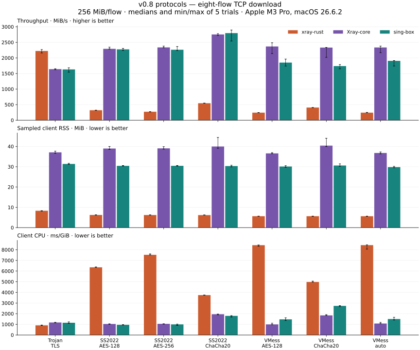

# v0.8: Trojan, SS2022 and VMess against full reference clients

**1050/1050 primary trials pass payload and process-cleanup checks. Overall performance parity: not met.**

The candidate uses less sampled client RSS than both references in every one of
70 cases. Trojan meets the existing Mac throughput target in 11/12 bulk
comparisons and the CPU target in 12/12. All 72 bulk comparisons for the six
SS2022/VMess profiles miss both the throughput and CPU targets. Successful
traffic and lower memory therefore do not establish overall parity. Echo
latency is mixed: 35/56 median-RTT comparisons meet the 3% target.

These are five-repeat host-local SOCKS measurements on Apple M3 Pro (12 cores,
18 GiB), macOS 26.6.2 (25G83), AC power. The primary collection lasted 59.5
minutes. No compiler activity was flagged by the retained observer. This is a
shared Mac, not evidence of a completely idle host or physical-device behavior.

## One fixed workload slice

Eight concurrent TCP download flows, 256 MiB per flow. Values are median MiB/s
of five fresh processes; higher is better. The figure also shows sampled RSS
and client CPU, with full min/max whiskers. This fixed slice does not replace
[all 70 cases and metrics](all-metrics.md).

| Profile | xray-rust | Xray-core | sing-box |
| --- | ---: | ---: | ---: |
| Trojan TLS | 2222.4 | 1639.5 | 1630.8 |
| SS2022 AES-128 | 320.8 | 2291.7 | 2275.2 |
| SS2022 AES-256 | 271.4 | 2337.6 | 2262.9 |
| SS2022 ChaCha20 | 545.1 | 2753.6 | 2796.3 |
| VMess AES-128 | 242.2 | 2367.4 | 1849.9 |
| VMess ChaCha20 | 406.9 | 2331.6 | 1738.2 |
| VMess auto | 242.5 | 2335.6 | 1905.4 |



In this slice, SS2022 uses 6.17–6.23 MiB RSS in Rust versus 30.33–39.97 MiB in
references; VMess uses 5.61–5.63 MiB versus 29.80–40.39 MiB. Their bulk speed
and CPU disadvantages remain large. This campaign measures the deficit; it
contains no product optimization or claim about its cause.

## Exact implementations

| Role | Source | Compiler | Executable SHA-256 |
| --- | --- | --- | --- |
| xray-rust | `0250497b7f8aaca66b0086b95892558e7042cc98` | Rust 1.96.0 | `7d044a421ea8878cb6735096d2b027d4ea8d8cb6e2660b9f5b89cff0336a832c` |
| Xray-core v26.7.28 | `5ca6f4b7d4dc20a881d4330e498892697627ec0c` | Go 1.26.0, CGO=0 | `fcbfcfe586d891ecf556570acd32ce5160e803498e30fe072d151d0056d23b99` |
| sing-box v1.13.20 | `56f91dfeabd6f4edbd437dfcc1e5b0ebc856b778` | Go 1.26.0, CGO=0 | `5d17d2b91fb5b022be50fc49c74cb6aed84dcae9e94011159a31da3f211412ff` |
| Workload driver | `2d8afb6e6d9f601f0446aa74382f6e24dac9a7dd` | Rust 1.96.0 | `98995b304613f27bd5040221bcb1462f2c85a8eaff264eb2a4b18962714454ce` |

[Build provenance](data/inputs.json) includes the Rust tree IDs and arguments,
Go dependency/build metadata, and the checksum-verified sing-box module origin.
Both Go clients use the same compiler; sing-box includes uTLS, gVisor, QUIC and
WireGuard tags. The collector is also from `2d8afb6e6d9f601f0446aa74382f6e24dac9a7dd`.
Its commit is separate from the measured runtime and SDK core pin.

The [source audit](data/runtime-equivalence.json) confirms that production
crates, Cargo inputs and vendor code did not change from the frozen runtime.
The changes are confined to benchmark drivers, tests, CI and documentation.
[Complete CI](https://github.com/aimalygin/xray-rust/actions/runs/36803952030)
passes on `04075f42bb500661246ae8dc590ef17d6285609b`, which only adds the matching
workflow-policy expectation to the driver commit. Local validation includes
211 benchmark-library tests and 25 Python collector/comparison tests.

## Workloads and accounting

Seven profiles × two flow counts (1/8) × five workloads × three clients × five
repeats gives 1050 trials. Workloads are TCP upload, download, full-duplex,
TCP echo and UDP echo. Bulk validates 256 MiB per flow/direction in 64 KiB
chunks. Echo runs 1000 exchanges per flow, with 1024-byte TCP or 1200-byte UDP
payloads. UDP is concurrent request/response, not a maximum-PPS test. The final
short smoke matrix passes 210/210 trials and is excluded from performance medians.

All clients use the same Xray server within a case/repeat. The next repeat gets
fresh server state and credentials; fresh client processes run in rotating
order. A verified fixed-size TCP echo and close precede resource measurement.
For every bulk client, a validated one-byte client preface precedes the target's
READY marker. These setup bytes are outside payload counts and the transfer
window. CPU includes workload setup/settling; startup wall time includes warmup
and close handling, and is not pure process launch latency. Workload, startup
and lifetime CPU remain separate in the raw results.

Trojan uses verified TLS, a Chrome fingerprint and HTTP/1.1 ALPN. Rust/Xray pin
the leaf; sing-box pins its public key after the translator checks the same
leaf digest. SS2022 covers all three 2022 methods. VMess uses AEAD with alterId 0,
global padding, the default unauthenticated length mode and XUDP for the selected
UDP ports. SS2022/VMess have no extra TLS layer. General Mux, extra transports,
SS2022 identity chains, AEAD-2017 and legacy VMess are outside this baseline.
All engines retain stock worker/GC defaults, with inherited overrides cleared.

RSS is client-process sampled peak every 100 ms, excluding kernel buffers,
server and driver; short allocation peaks can be missed. Client CPU counters
are coarse on macOS. Server and driver still share the same host CPU. Matched
inputs do not remove host scheduling noise. Complete settings and commands
are in the [reproduction guide](../../../v08-performance.md).

## Retained preparation failures

Two earlier smoke attempts are retained with their failures and distinct driver
identities; they are not pooled into the final medians:

1. The first attempt passed 30 Trojan trials, then Xray SS2022 warmup timed out.
   Its echo succeeded, but the old target waited for a half-close the reference
   did not propagate. The driver now closes after its fixed-size reply, with a
   regression test; all engines use that same warmup.
2. The next attempt passed 120 trials, then Xray VMess AES-128 upload failed with
   early EOF in the server-first workload. A minimal reproduction received zero
   upload bytes from Xray. Rust and sing-box passed the same original driver.
   The common performance matrix now uses the same client-first preface for all
   three implementations, with positive/negative tests. The server-first failure
   remains a separate compatibility observation for this pinned Xray version;
   it is not relabeled as a successful primary trial.

The archive includes both original smoke manifests/results and diagnostic logs.
Reference code was not changed. No claim is made that the common client-first
benchmark covers server-first traffic or proves complete reference equivalence.

## Targets, uncertainty and evidence

The existing Mac comparison policy requires strictly lower RSS, throughput at
least 97% of each reference, and CPU/latency/startup at most 103%. The separate
[strict summary](data/summary-strict.json) uses zero allowance. The
[3% assessment](data/summary-mac-3pct.json) is `not_met`, with all 140 case/reference
pairs complete. It retains 432 metric-comparison entries outside the target
(501 under the strict policy) and 583 entries without a supporting paired
bootstrap interval. These include correlated metrics and are not counts of
independent defects. Five repetitions cannot prove equality or universal performance.
[Every point deficit](point-deficits.md), every sample, range and paired 95%
interval remains available.

[measurements.tar.gz](measurements.tar.gz) contains exact numeric raw results,
resource samples, manifests, source-patch records and failed diagnostic logs.
It omits transient synthetic credentials/configs and executable binaries, which
remain in the local campaign. [evidence-index.json](evidence-index.json) binds
all archived files and the archive digest. Both published summaries were
recomputed from the extracted archive and compared exactly; see
[archive verification](data/archive-verification.json).

From the repository root, inspect the numeric archive and regenerate the 3% assessment:

```sh
mkdir -p /tmp/v08-results
# Verify the archive SHA-256 against evidence-index.json before extraction.
tar -xzf docs/benchmarks/results/2026-09-30-v08-protocols/measurements.tar.gz -C /tmp/v08-results
python3 scripts/summarize-v07-protocol-parity.py /tmp/v08-results/full \
  --max-regression-pct 3 --output /tmp/v08-results/recomputed.json
python3 docs/benchmarks/results/2026-09-30-v08-protocols/data/chart.py \
  docs/benchmarks/results/2026-09-30-v08-protocols
```

These measurements cover SOCKS on this host. The existing Rust TUN checks stay
separate because the stock reference CLIs do not expose the same supplied-FD
path uniformly. They do not establish WAN, battery, mobile SDK/device or
physical-network-transition performance. Apple device testing remains explicitly
deferred, Android hardware is unavailable, and the 0.8 device/publication gates
remain open. No tag, SDK artifact lock or release is produced by this campaign.
